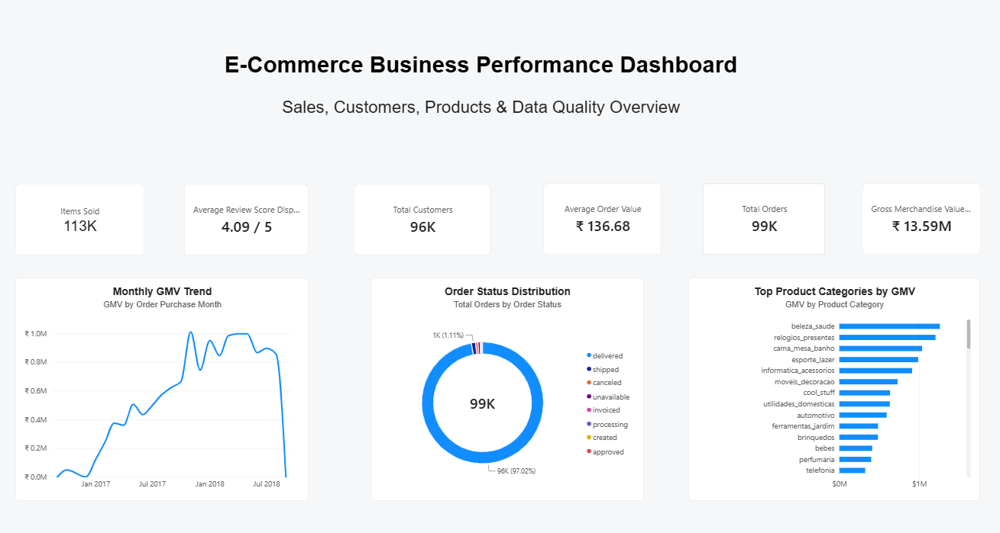
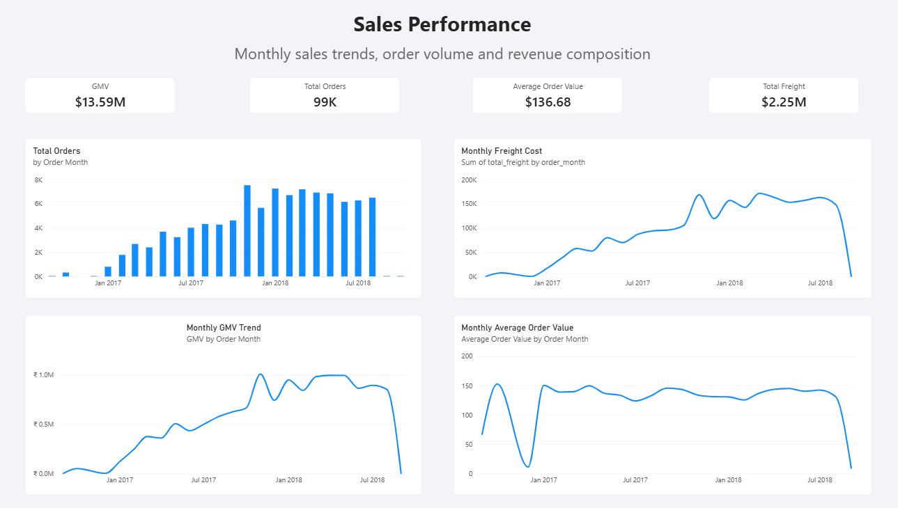
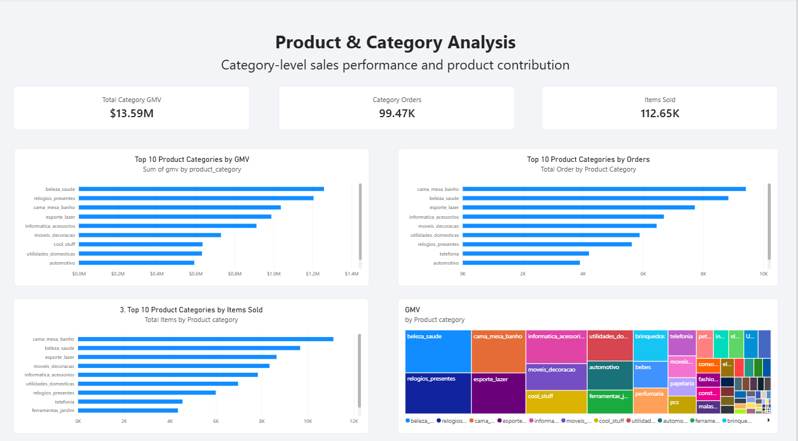
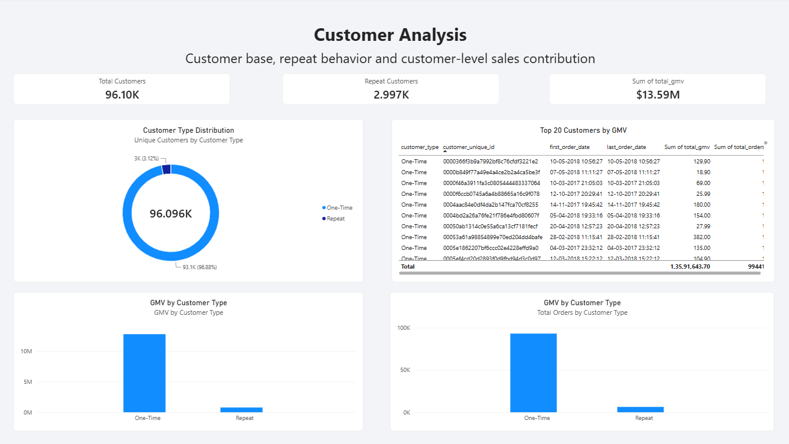
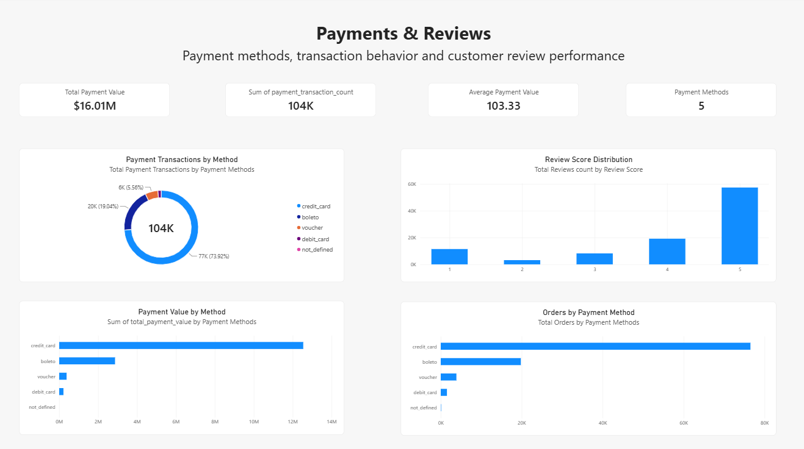
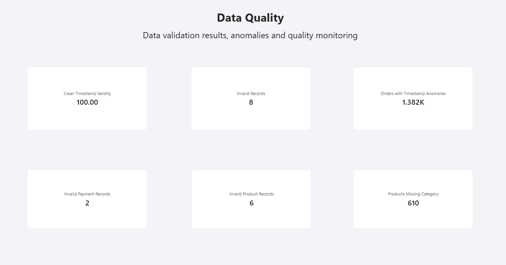
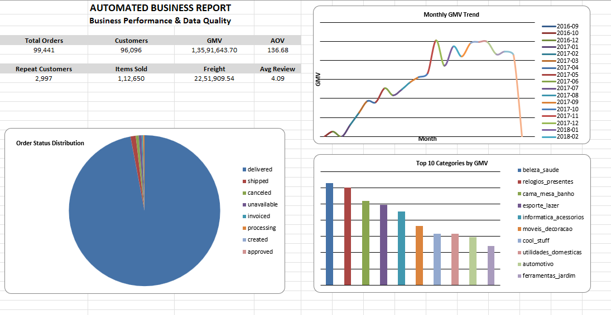

# Automated Business Reporting & Data Quality System

## Overview
An automated, end-to-end analytics pipeline that ingests raw e-commerce CSV data, performs rigorous data-quality validation, cleanses and models the data into a PostgreSQL warehouse, and powers both an automated Excel report and a Power BI dashboard. 

## Business Problem
Organizations frequently struggle with dirty, inconsistent raw data scattered across CSVs, which leads to inaccurate reporting, fan-out issues in relational queries, and a lack of trust in final KPIs. This project solves that by enforcing a strict validation and staging layer before any business metric is calculated.

## Objective
Build an automated analytics pipeline that ingests raw CSV business data, performs data-quality validation, cleans and transforms the data, loads reliable analytical structures into PostgreSQL, generates KPI reporting in Excel, and provides a Power BI dashboard for business and data-quality monitoring.

## Dataset
Brazilian E-Commerce Public Dataset by Olist
Kaggle: [https://www.kaggle.com/olistbr/brazilian-ecommerce](https://www.kaggle.com/olistbr/brazilian-ecommerce)

## Technology Stack
- **Languages:** Python, SQL
- **Libraries:** Pandas, SQLAlchemy, psycopg2, python-dotenv
- **Database:** PostgreSQL
- **Reporting/BI:** Excel, Power BI

## Architecture
The pipeline separates concerns across distinct layers (PostgreSQL schemas):
- **staging:** Raw data loaded as-is.
- **quality:** Quarantine table for invalid records and data quality reports.
- **clean:** Validated, transformed data ready for analytical queries.
- **analytics:** Pre-aggregated views containing business logic and fan-out protection.
See [Architecture Documentation](docs/architecture.md) for details.

## Data Pipeline
The pipeline is orchestrated automatically via a Python script (`run_pipeline.py`) that safely executes data ingestion, validation, cleaning, view generation, Excel reporting, and finally reconciliation testing.

## Data Quality Framework
- **Quarantining:** Objectively invalid records (e.g., negative weights, missing dimensions, missing installments) are isolated in `quality.invalid_records` and omitted or safely handled in the `clean` layer.
- **Null Preservation:** Legitimate missing data is preserved as NULL.
- **Anomalies:** E.g. delivery timestamps occurring logically before approval timestamps. The dates are nullified in the `clean` layer but the parent order is strictly retained so GMV and sales counts remain unaffected.

## Key Data Quality Findings
- **Timestamp Anomalies:** 1,382 orders exhibited out-of-order delivery timestamps. 
- **Product Issues:** 6 product records had missing/invalid physical dimensions and were quarantined. 
- **Payment Issues:** 2 payment records had invalid installments (< 1) and were quarantined. 

## KPI Definitions
We define Primary GMV strictly as the sum of items' price (`clean.order_items.price`). Freight is tracked separately, giving a Total Merchandise + Freight. Total customers and repeat analysis rely on `customer_unique_id`.
See [KPI Definitions](docs/kpi_definitions.md) for the exact metrics.

## Analytics Layer
Because order items, payments, and reviews have one-to-many relationships to orders, doing a single massive JOIN creates severe fan-out (double counting). The `analytics` schema solves this by pre-aggregating each domain independently before joining at the order or customer grain.

## Excel Reporting
The pipeline automatically dumps the analytical views into a formatted, multi-sheet Excel workbook (`automated_business_report.xlsx`), complete with charts and executive summaries.

## Power BI Dashboard
A manually designed 6-page Power BI dashboard sits on top of the `analytics` PostgreSQL schema. It requires a manual/scheduled data refresh after the Python pipeline runs. It does not ingest the raw CSVs, nor is it automatically generated by Python.

## Automation
The orchestration script `run_pipeline.py` executes all stages sequentially. It stops execution cleanly if any step fails. The script is idempotent; it safely drops/replaces tables allowing multiple safe reruns without duplicate data.

## Validation & QA
At the end of `run_pipeline.py`, the orchestrator queries PostgreSQL directly to ensure the newly calculated KPI views perfectly match expected baseline tolerances (e.g., exactly 99,441 orders).

## Project Results
- **Orders:** 99,441
- **Distinct Customers:** 96,096
- **Repeat Customers:** 2,997
- **GMV:** $13,591,643.70
- **Total Freight:** $2,251,909.54
- **Merchandise + Freight:** $15,843,553.24
- **AOV:** $136.68
- **Items Sold:** 112,650
- **Average Review Score:** 4.09
- **Clean Payment Value:** $16,008,683.49

*Note: Payment value exceeds merchandise + freight by $165,130.25. The current dataset does not provide sufficient evidence to attribute this difference to specific factors, so payment value is retained as a separate payment/reconciliation metric rather than being used as the primary GMV measure.*

## Limitations
- **Data Load:** Pandas is used for initial memory-based loading, which may not scale to multi-gigabyte datasets without chunking or switching to a `COPY` command.
- **Customer Details in Excel:** The Excel customer detail tab is artificially capped at 500 rows to prevent workbook bloat. Full drill-down should be performed in Power BI.
- **Refresh Strategy:** Full truncate-and-load is used rather than incremental logic.

## Repository Structure
```
├── data/
│   └── raw/                   # Source CSV files (not committed)
├── docs/                      # Documentation
├── reports/
│   ├── excel/                 # Generated automated reports
│   └── screenshots/           # (Placeholder for PBI visual evidence)
├── src/
│   ├── ingestion/
│   ├── validation/
│   ├── cleaning/
│   ├── analytics/
│   └── reporting/
├── .env.example
├── .gitignore
├── run_pipeline.py            # Main Orchestrator
└── README.md
```

## Setup Instructions
1. Clone the repository.
2. Create a virtual environment and `pip install -r requirements.txt`.
3. Rename `.env.example` to `.env` and provide your PostgreSQL credentials.
4. Ensure PostgreSQL is running and you have privileges to create databases.
5. Place the Olist CSV files into `data/raw/`.

## How to Run
```bash
python run_pipeline.py
```

## Screenshots
## Dashboard & Report Screenshots

### Power BI Dashboard

#### 1. Executive Overview


#### 2. Sales Performance


#### 3. Product & Category Analysis


#### 4. Customer Analysis


#### 5. Payments & Reviews


#### 6. Data Quality


### Excel Report

#### Executive Summary


## Future Improvements
- Replace Pandas `to_sql` with native Postgres `COPY` for scalable ingestion.
- Implement Airflow or Dagster instead of a standalone Python orchestrator script.
- Introduce dbt for managing the SQL `analytics` views.
